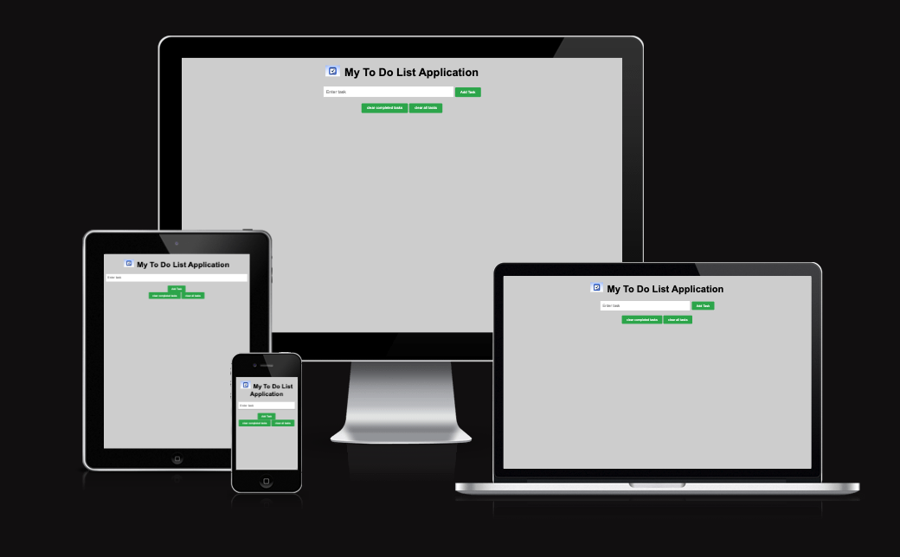
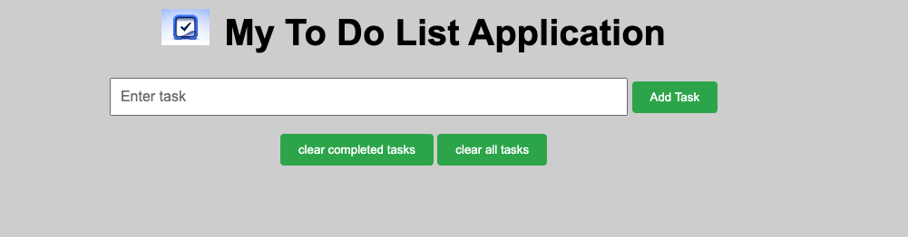
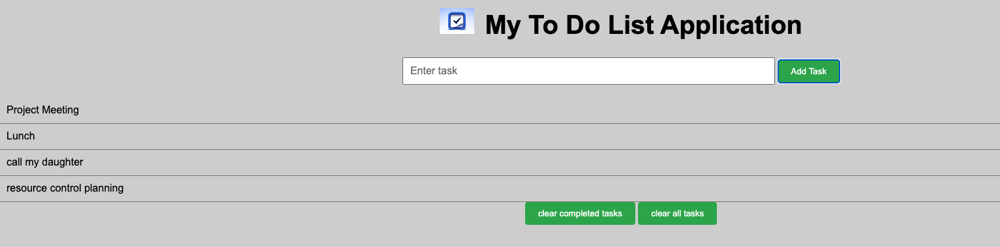
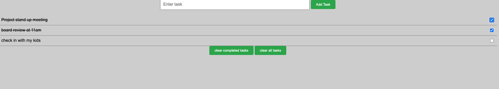
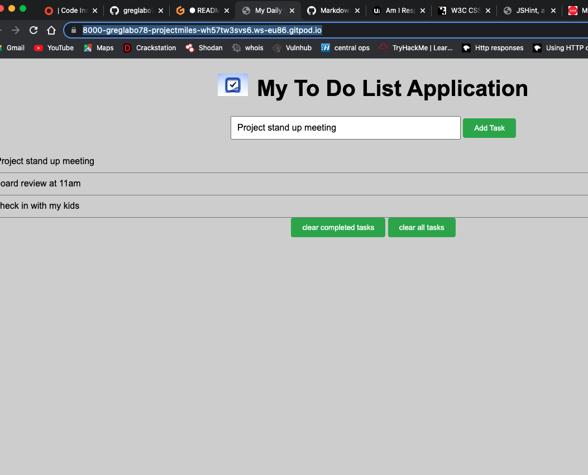

**TO DO LIST APPLICATION**
========================

**Visit** [**TODO List App**](https://8000-greglabo78-projectmiles-p0ioxtmbmni.ws-eu86.gitpod.io/)

# Purpose
The ToDo List application is a website primarily designed to facilitate in 
aiding a user to meet thier daya to goals.

The website enables the user to view thier activites (tasks) as 
a task list and to modify to establish task completed and to clear the list 
should the gola have been met.

# User Stories
As a user, I would like to view all entries in tasklist format
As a user i would like to identify completed tasks
As a user i would like to clear up my task list
As user i would like to remove completed task from my list
As a user i would like to avoid having the same tasks input twice
As a user i would like to avoid an empty entry

# Features

- Add a Task
- Clear completed tasks
- Clear all tasks

# Testing

## Code Validation
  - W3C HTML Validator
    - [index.html](readme-images/W3C%20html%20validation.png)

- W3C CSS Validator
    - [style.css](readme-images/W3C%20Css%20Validation%20.png)

Lighthouse mobile

Lighthouse Desktop

## Test Cases

Test Label | Test Action | Expected Outcome | Test Outcome
-------- |-------- |-------- |-------- |
Data entry | Submit empty task into the form | Alert telling user to put a task name | PASS
Data entry | Submit a task name | task is added to the task list | PASS
completed task | task checkbox is toggled to checked | task display changes and is struckout on the list | PASS
Clear Completed task | check all completed task and click clear completed task button | all checked task are removed from the task list | PASS
Clear Completed task | leave all task unchecked and click clear completed task button | task remain unchanged on the tasklist | PASS
Clear all tasks | click the clear all task button | all tasks checked or unchecked is removed from the task list | PASS
Submit form | click the add a task button | task is added to the tasklist | PASS
Submit form | Press Enter/return key on the keyboard | task is added to the task list | PASS

As a user, I would like to view all entries in a tasklist format

   - 

As a user i would like to identify completed tasks

  - 

As a user i would like to avoid having the same tasks input twice

  - 

As a user i would like to avoid an empty entry

  - 

### Browser Compatibility

Safari

- 

Chrome

- 

Micorsoft Edge

## Fixed Bugs

- CSS code flagged by W3C validator for one error

# Technology

- GitPod
    - GitPod was used for writting all the code

- GitHub Pages
    - GitHub pages was used for hosting the website

Chrome Dev Tools
  - Google chrome built in dev tools was used for testing

GitHub
  - GitHub was used for storing the code

# Supported screens and browsers

- For this web application diffeent screen sizes were used and tested and no errors were found.
  - 1024px wide
  - 992px wide
  - 786px wide
  - 576px wide

- Broswers
  - Google Chrome
  - Microsoft Edge
  - Safari

# Deployment

## GitHub Pages

- The site was deployed to GitHub pages. Below are the steps to deploy:
- In the GitHub repository, navigate to the settings tab
- From the source section drop-down menu, select the main branbch
- Once you have seslected the main branh , the page will refresh automatically with a detailed ribbon display
  to indicate a succesful deployment.

GitPod
- The site was coded using Gitpod.
- In the GitHib repository, press the green GitPod button for the transfer of the project
  to the GitPod enviroment

# Credit
- Brian Macharia my mentor who gave me this idea and guided me on the scope 
- Code Institute for the [Love Maths](https://greglabo78.github.io/love-maths/) project that was the spark that started all this
-  All Pictures used on the website were taken from Google images
- Slack forum for thier continous support on my jurney thus far

