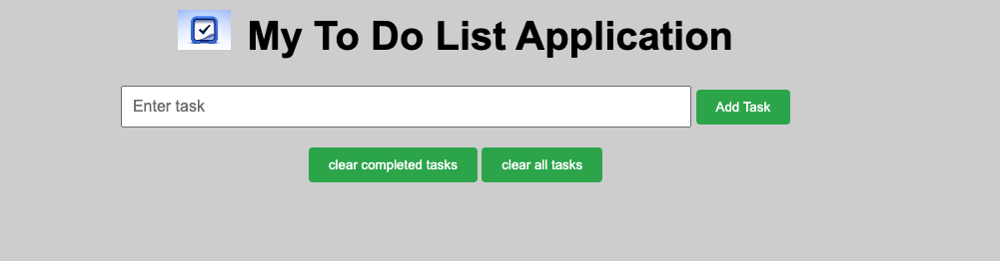
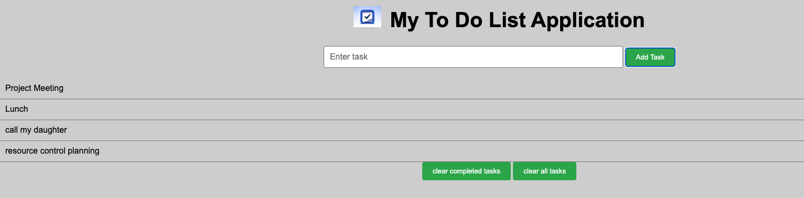
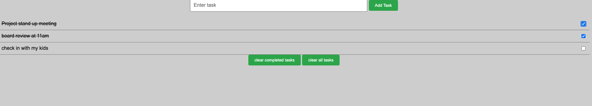
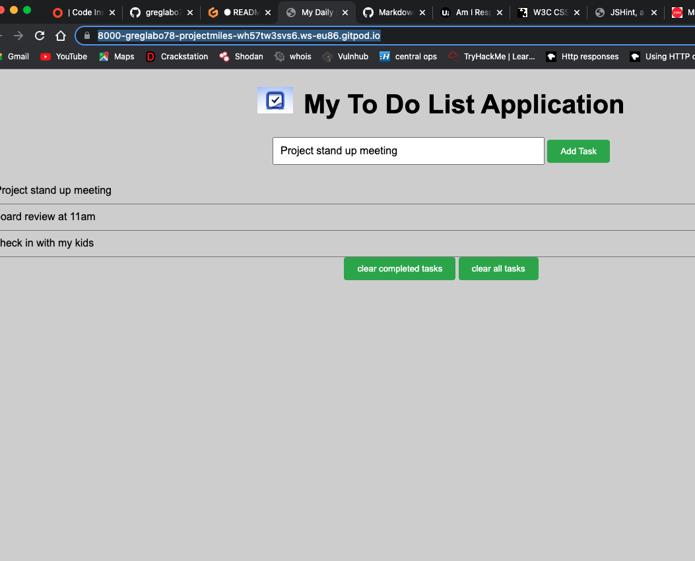

**TO DO LIST APPLICATION**
========================

**Visit** [**TODO List App**](https://8000-greglabo78-projectmiles-p0ioxtmbmni.ws-eu86.gitpod.io/)

# Purpose
The ToDo List application is a website primarily designed to facilitate in 
aiding a user to meet thier daya to goals.

The website enables the user to view thier activites (tasks) as 
a task list and to modify to establish task completed and to clear the list 
should the gola have been met.

# User Stories
As a user, I would like to view all entries in tasklist format
As a user i would like to identify completed tasks
As a user i would like to clear up my task list
As user i would like to remove completed task from my list
As a user i would like to avoid having the same tasks input twice
As a user i would like to avoid an empty entry

# Features

- Add a Task
- Clear completed tasks
- Clear all tasks

# Testing

## Code Validation
  - W3C HTML Validator
    - [index.html](assets/images/W3C%20html%20validation.png)

- W3C CSS Validator
    - [style.css](assets/images/W3C%20Css%20Validation%20.png)

Lighthouse mobile

Lighthouse Desktop

## Test Cases

As a user, I would like to view all entries in a tasklist format

   - 

As a user i would like to identify completed tasks

  - 

As a user i would like to avoid having the same tasks input twice

  - 

As a user i would like to avoid an empty entry

  - 

### Browser Compatibility

Safari

- 

Chrome

- 

Micorsoft Edge

## Fixed Bugs

- CSS code flagged by W3C validator for one error

# Technology

- GitPod
    - GitPod was used for writting all the code

- GitHub Pages
    - GitHub pages was used for hosting the website

Chrome Dev Tools
  - Google chrome built in dev tools was used for testing

GitHub
  - GitHub was used for storing the code

# Supported screens and browsers

- For this web application diffeent screen sizes were used and tested and no errors were found.

